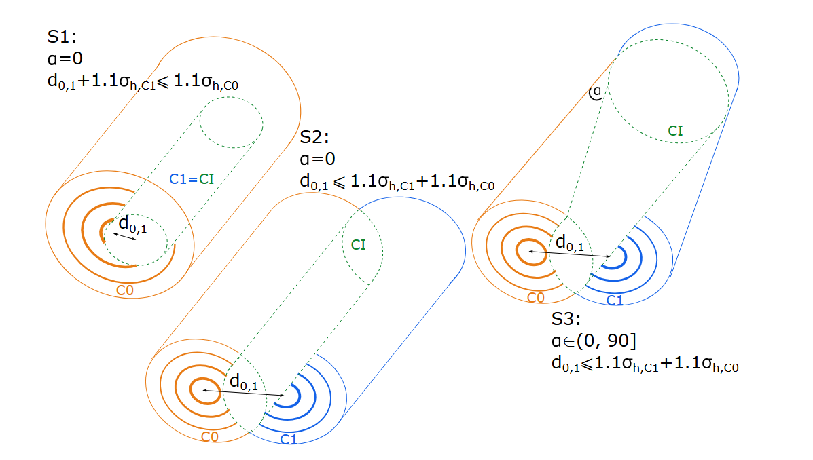

# Intersected Contrails

This open-source project provides a simulation framework for modeling the lifetime and evolution of aircraft condensation trails (contrails) using a Gaussian plume (exhaust dispersion) approach. In the following section, a brief description of the installation, simulation, and assumptions is given. The usage of the program is described in [this section](#usage).

The code is part of the publication (TBA, submitted), which provides more detailed descriptions, explanations, and the formulation of the model.

## Dependencies
- Java 17+
- Maven (Recommended) 
- Your IDE
## Installation / Running the Project

First, clone the repository to your local directory, and open the folder with your IDE. Once complete, in your terminal, navigate to your project directory, type `mvn clean install`. Or paste the following command:  

`mvn clean install
java -cp target/classes ContrailsWakeVortex2020.central_control_of_scenarios
`

Afterwards, go to your project folder, open `Config_vortex0.txt`, and change the weather GRIB file path at the end of the line. 

> An example GRIB weather file is provided in the project folder: grib_01_2016-02-07_1200.grib2. Change the final line to your own directory. However, it is also possible to simulate a different environment, as long as you have a different .grib2 file.
>
Please also change `Config_vortex1_for_s0&1&3.txt` and `Config_vortex1_for_s2.txt` with the same steps.

When ready, navigate to `**your project folder**\src\ContrailsWakeVortex2020` run `central_control_of_scenarios.java` for scenario creations. 

## Parameters

### Contrail Parameters: 
- `TAS`  True Air Speed, and converted into meters per second
- `altitude` Aircraft flight altitude, and converted into meters
- `M` Aircraft mass in kilograms
- `fuelflow` Fuel flow in kilograms per second
- `distance` Calculated based on Latitude and Longitude

### Meteorology inputs:
- `Radiosonde file`(The Atmospheric Sounding Data that includes Temp, p, RH, Theta, dThetadz.)
- `s` Shear rate in 1/s
- `Vz `Vertical wind speed m/s
- `mean value of wind velocity` at flight level [m/s]
- `uprime` [m/s] horizontal wind fluctuation
- `Dv` Vertical Diffusion in m²/s
- `Dh` Horizontal Diffusion in m²/s
- `Gribfile` Contains the atmospheric environment. 

> For every time stamp, the following parameters are constructed and calculated.
- `distance` distance from last flight profile step [m]
- `Dv, Dh, Ds` vertical, horizontal and sheared diffusion [m2/s]
- `vo` mean value of wind velocity at flight level [m/s]
- `s` constant wind shear

## Usage

To run the simulation, execute `\src\ContrailsWakeVortex2020\central_control_of_scenarios.java`. Simply run from your IDE, and a guide will show up on the console. Pressing numbers between 0-3 to select the scenario, and for selecting the angle, type a number between `0-90` to represent: `[0 degree, 90 degree]`.

### Contrail Scenarios

This model considers four scenarios describing the relative spatial configurations of two contrails (C0 and C1).

| Scenario | Condition                                                | Description                                                                                                                    | Configuration Type  |
| -------- | -------------------------------------------------------- | ------------------------------------------------------------------------------------------------------------------------------ | ------------------- |
| **S0**   | Independent                                              | Contrail 0 and Contrail 1 are spatially independent, with no overlap or interaction.                                           | Independent         |
| **S1**   | *a = 0* (parallel)   `d₀,₁ + 1.1σₕ,C1 ≤ 1.1σₕ,C0`     | Contrail 1 is completely formed inside Contrail 0, showing **full inclusion** (nested structure).                              | Inclusive / Nested  |
| **S2**   | *a = 0* (parallel)   `d₀,₁ ≤ 1.1σₕ,C1 + 1.1σₕ,C0`     | Contrail 0 and Contrail 1 are parallel with **partial overlap** of their cross-sections, but neither fully contains the other. | Parallel Overlap    |
| **S3**   | *a ∈ (0, 90]* (angled)   `d₀,₁ ≤ 1.1σₕ,C1 + 1.1σₕ,C0` | Contrail 0 and Contrail 1 intersect at a nonzero angle, with overlapping regions depending on distance and σ parameters.       | Angled Intersection |

Note: In reality, a time gap of 0 seconds would imply two aircraft colliding, which is not physically possible. Instead, we set a time gap of 900 seconds to represent a delayed generation of the second contrail, allowing meaningful overlap/intersection scenarios without implying collision. So that:
- The Simulation can be allowed to have sufficient time for C0 to form and diffuse.
- A too-short time gap (for example, 0) could potentially trigger TCAS.

However, the gap time can still be modified in the main logic of the calculation. `src\ContrailsWakeVortex2020\wake_vortex_individual_s0.java, etc.`

## Calculation Steps
The main logic of the calculation is to simulate the evolution of aircraft contrails and their interaction with atmospheric conditions. Which is located in `src\ContrailsWakeVortex2020\wake_vortex_individual_s0.java, etc.` The physical process of **Diffusion**,  **Vertical Motion:**,  **Adiabatic Heating**, and the changes in **Ice Particles** are formed in the following steps.

### 1. Parameter Initialization

-   Read configuration files for two contrails (contrail_0 and contrail_1).
-   Initialize all relevant parameters, such as altitude, speed, mass, fuel flow, diffusion coefficients, wind speed, and atmospheric data from GRIB files.

### 2. Initial State Calculation

-   For each contrail, calculate the initial geometric parameters (height, width, radius) using the  `Contrail_depth()`  method.
-   Compute initial diffusion coefficients and atmospheric properties (temperature, humidity, potential temperature, etc.).

### 3. Contrail Evolution Simulation (`ContrailEvolution()`)

-   For each contrail, calculate the initial number of ice particles, cross-sectional area (`CCS`), and ice water content (`IWC`).
-   Check if the ambient humidity is sufficient for contrail formation (RHice > 100%). If not, the simulation stops.

### 4. Time-Stepping Loop

-   Advance the simulation in time steps.
-   For each time step and for each contrail:
    -   **Update Position:**  Calculate new latitude, longitude, and altitude based on wind and sedimentation.
    -   **Update Geometry:**  Update the contrail's width, height, and shear using diffusion and wind shear.
    -   **Update Temperature:**  Adjust temperature due to adiabatic processes.
    -   **Update Ice Water Content:**  Recalculate IWC and CCS based on the new state.
    -   **Check Humidity:**  If RHice drops below 100%, stop updating that contrail.
    -   **Output Data:**  Write the current state to output files.

### 5. Termination

-   The simulation ends when the ice water content drops below a threshold or the ambient humidity is insufficient.
-   Output files are closed.

## Simulation Output
The simulation output is located in `src\records\results` with a naming structure for:
`Scenarionumber_intersectiondegree_Position_vortexnumber`. The simulation output is a `.txt` file, which also contains the simulation input parameters. 
You can also check in the console, where this information is located:
> `intersection_state_indicator` 
> `intersection_volumn_cal`
> `intersection_2D_size_esti`

These parameters are used during the calculation, which indicates the status(Parallel/Intersected/Intercepted) of two simulated contrails.

## License
This project is licensed under the Apache License 2.0 - see the [LICENSE](./LICENSE.txt) file for details.

